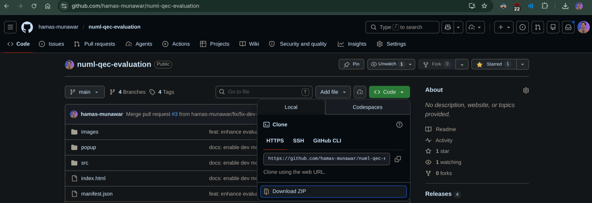
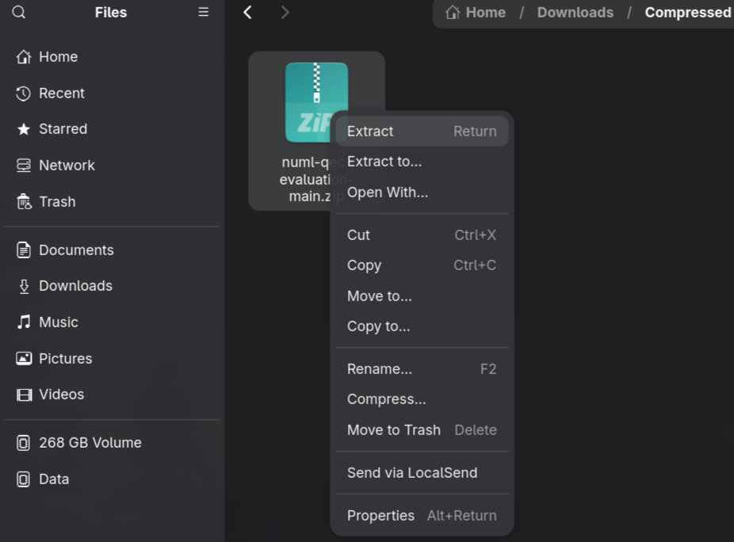
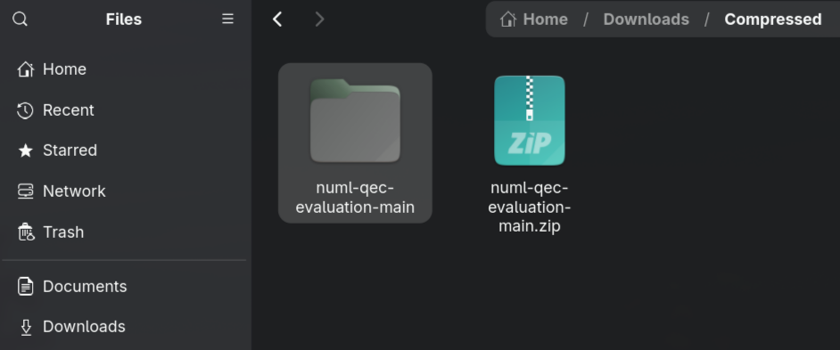
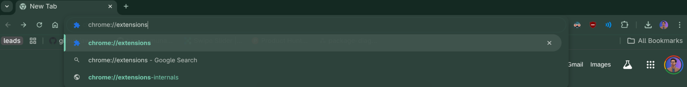
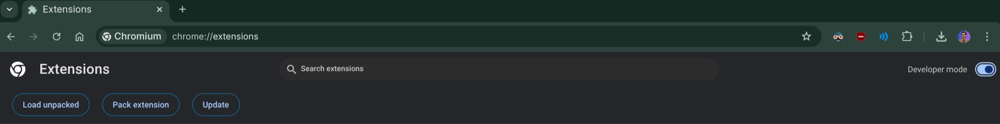
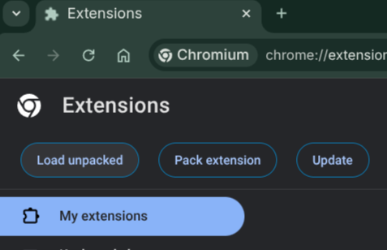
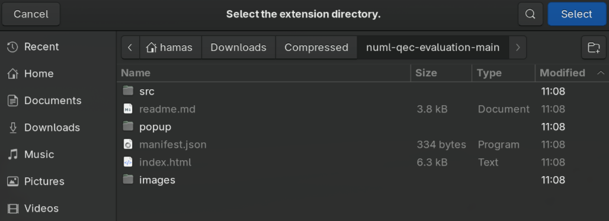
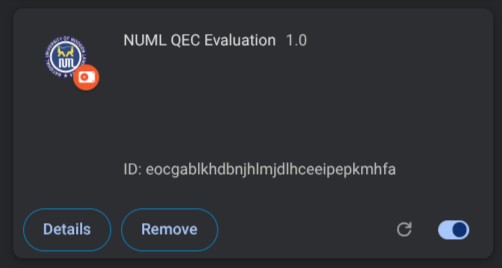
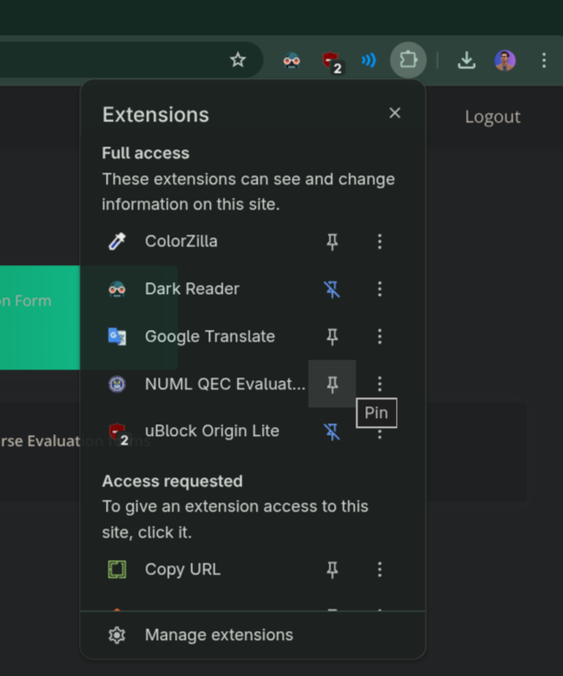
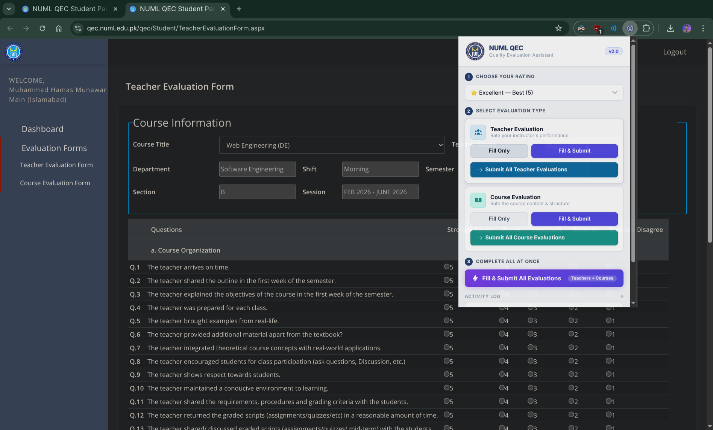

# 🎓 NUML QEC Evaluation — v2.1.1

A browser extension for **NUML students** that automatically fills and submits QEC evaluation forms — with professional, randomized feedback and full control over your rating.

---

## ✨ What's New in v2.1.1

### More Actions Per Section

Each evaluation type (Teacher & Course) now has **three options** instead of two:

| Button                            | What it does                                                                                |
| --------------------------------- | ------------------------------------------------------------------------------------------- |
| **Fill Only**                     | Fills the form with comments — you review before submitting                                 |
| **Fill & Submit**                 | Fills and submits the current form automatically                                            |
| **Submit All Teachers / Courses** | Iterates every teacher or course in the dropdown and fills & submits each one automatically |

### One-Click Complete Run

The **"Fill & Submit All Evaluations"** button at the bottom handles everything — all Teacher _and_ Course forms — in a single click, without you having to navigate anywhere.

### Smart Comment Library

Pulls from **10 unique, detailed comments per rating tier** so your feedback never looks copy-pasted.

### Live Activity Log

A real-time log shows every step as it happens, with a colour-coded status dot (blue = running, green = done, red = error).

---

## 🚀 How to Install

### Step 1 — Download the project

Go to the [GitHub repository](https://github.com/hamas-munawar/numl-qec-evaluation), click the green **`<> Code`** button, then click **Download ZIP**.

---

### Step 2 — Extract the ZIP

Right-click the downloaded ZIP file and extract it to a folder you'll remember.

You should see a folder containing `index.html`, `manifest.json`, and the `src/` folder.

---

### Step 3 — Open Chrome Extensions

Type `chrome://extensions` in the Chrome address bar and press **Enter**.

---

### Step 4 — Enable Developer Mode

Toggle the **Developer mode** switch in the top-right corner **On**.

---

### Step 5 — Load the extension

Click **Load unpacked** in the top-left, then select the extracted project folder.

The extension will now appear in your extensions list.

---

### Step 6 — Pin it to your toolbar

Click the 🧩 puzzle icon in the Chrome toolbar and pin **NUML QEC Evaluation** for easy access.

---

## 🛠️ How to Use

### For a single form (quick use)

1. Log in to the [NUML QEC Portal](https://qec.numl.edu.pk/qec).
2. Navigate to a **Teacher** or **Course** evaluation form.
3. Open the extension → pick your **Rating Level**.
4. Click **Fill Only** to review first, or **Fill & Submit** to submit immediately.

### To auto-submit all forms at once (recommended)

1. Log in and navigate to a **Teacher** or **Course** evaluation form on the portal.
2. Open the extension → pick your **Rating Level**.
3. Click **Submit All Teacher Evaluations** or **Submit All Course Evaluations** — the extension will iterate through every teacher/course in the dropdown, fill each form, and submit it automatically.
4. Or click **Fill & Submit All Evaluations** to do both types in one run.
5. Watch the **Activity Log** at the bottom to track progress.

> **Tip:** Use **Fill Only** first to preview the generated comments before committing to a full submit run.

---

## ⭐ Rating Guide

| Rating                 | Portal Scale | Use when…                        |
| ---------------------- | ------------ | -------------------------------- |
| Excellent — Best       | 5 Stars      | Genuinely great teacher / course |
| Very Good              | 4 Stars      | Good overall with minor issues   |
| Satisfactory — Average | 3 Stars      | Neutral / standard experience    |
| Below Average          | 2 Stars      | Notable issues worth flagging    |
| Poor — Worst           | 1 Star       | Serious concerns about quality   |

---

## ⚖️ Disclaimer

This tool is designed to help students complete mandatory QEC feedback efficiently. We recommend using **Fill Only** periodically to review the generated comments and ensure they reflect your actual experience before submitting.
